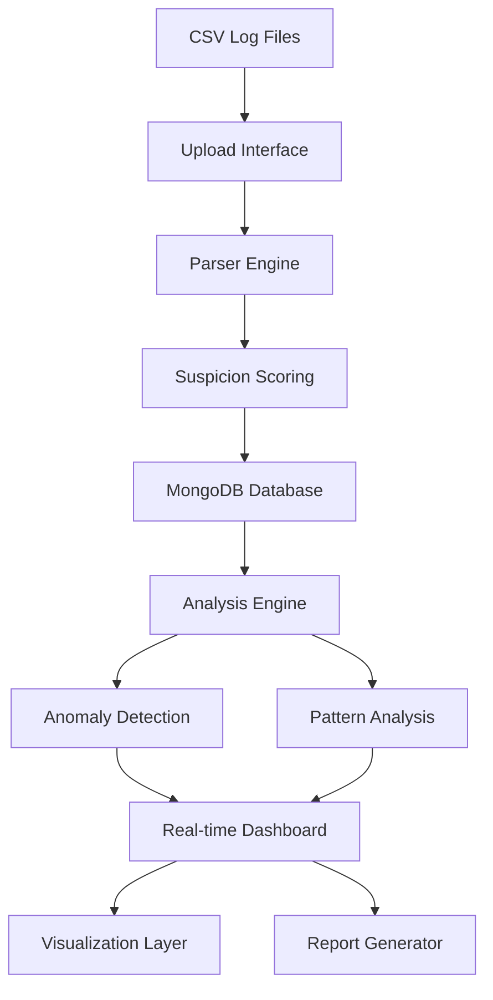

<div align="center">

# 🛡️ Nexum Obscura

### Advanced Cybersecurity Log Analysis Platform

*Empowering security teams with intelligent threat detection and network analysis*

[](https://nodejs.org/)
[](https://reactjs.org/)
[](https://mongodb.com/)
[](https://expressjs.com/)
[](https://tailwindcss.com/)

---

</div>

## 🎯 Overview

**Nexum Obscura** is a cutting-edge cybersecurity platform designed for real-time network log analysis, suspicious activity detection, and comprehensive security reporting. Built for the National CyberShield Hackathon 2025, it empowers security teams to identify threats, visualize network patterns, and generate actionable intelligence.

### ✨ Key Features

<table>
<tr>
<td width="50%">

**🔍 Intelligent Analysis**
- Advanced anomaly detection algorithms
- Real-time threat scoring
- Pattern recognition and analysis
- Geographic threat mapping

</td>
<td width="50%">

**📊 Powerful Visualization**
- Interactive network topology
- Real-time activity dashboards
- Comprehensive reporting suite
- Export capabilities

</td>
</tr>
<tr>
<td width="50%">

**⚡ Performance**
- High-volume log processing
- Efficient data indexing
- Real-time monitoring
- Scalable architecture

</td>
<td width="50%">

**🛠️ User Experience**
- Intuitive web interface
- Drag-and-drop file uploads
- Advanced search and filtering
- Mobile-responsive design

</td>
</tr>
</table>

---

## 🏗️ Architecture



### 📂 Project Structure

```
nexum-obscura/
├── 🗄️  backend/              # Express + MongoDB API Server
│   ├── 🛣️  routes/           # API endpoints & controllers
│   │   ├── upload.js         # File upload & CSV parsing
│   │   ├── search.js         # Log search & filtering
│   │   ├── analysis.js       # Analytics & dashboard data
│   │   └── reports.js        # Report generation & management
│   ├── 📋 models/            # MongoDB data schemas
│   │   ├── Log.js           # Network log entries
│   │   ├── Connection.js    # Connection patterns
│   │   └── Report.js        # Generated reports
│   ├── 🔧 utils/            # Core utilities & algorithms
│   │   ├── parser.js        # CSV parsing & validation
│   │   ├── analyzer.js      # Anomaly detection engine
│   │   └── reportGenerator.js # Report generation logic
│   └── ⚙️  index.js          # Server entry point
├── 🎨 frontend/              # React + Tailwind Interface
│   └── src/
│       ├── 📄 pages/         # Main application views
│       │   ├── Dashboard.jsx    # Real-time monitoring
│       │   ├── Upload.jsx       # File upload interface
│       │   ├── Analysis.jsx     # Advanced analytics
│       │   ├── Visualization.jsx # Network visualization
│       │   └── Reports.jsx      # Report management
│       ├── 🧩 components/    # Reusable UI components
│       │   ├── StatsCard.jsx    # Metric display cards
│       │   ├── ActivityChart.jsx # Timeline visualizations
│       │   ├── LogTable.jsx     # Searchable data tables
│       │   └── NetworkGraph.jsx # Network topology
│       ├── 🛠️  utils/        # Frontend utilities
│       │   ├── api.js           # Backend API client
│       │   └── helpers.js       # Formatting & utilities
│       └── App.jsx           # Main application component
├── 🔗 shared/               # Shared configurations
└── 📋 package.json          # Project dependencies
```

---

## 🚀 Quick Start

### Prerequisites

- **Node.js** 18+ 
- **MongoDB** 5.0+
- **npm** or **yarn**

### 📥 Installation

1. **Clone the repository**
   ```bash
   git clone https://github.com/iSamarthDubey/nexum-obscura.git
   cd nexum-obscura
   ```

2. **Install dependencies**
   ```bash
   npm run setup
   ```

3. **Environment Setup**
   ```bash
   # Backend environment
   cd backend
   cp .env.example .env
   # Configure MongoDB URI and other settings
   ```

4. **Start the application**
   ```bash
   # Terminal 1 - Backend
   npm run dev

   # Terminal 2 - Frontend
   cd frontend
   npm start
   ```

5. **Access the application**
   - Frontend: http://localhost:3000
   - Backend API: http://localhost:5000

---

## 🎮 Usage Guide

### 📤 Uploading Log Files

1. Navigate to the **Upload** section
2. Drag and drop your CSV log files or click to browse
3. Ensure your CSV contains these columns:
   ```csv
   timestamp,source_ip,dest_ip,source_port,dest_port,protocol,action,bytes,packets
   ```

### 📊 Dashboard Monitoring

The dashboard provides real-time insights:
- **Total log entries** processed
- **Suspicious activity** percentage
- **Critical threats** identified
- **Protocol distribution** analysis
- **Top suspicious IPs** ranking

### 🔍 Advanced Analysis

- **Search & Filter**: Find specific log entries
- **Anomaly Detection**: Identify unusual patterns
- **Pattern Analysis**: Understand traffic behaviors
- **Geographic Mapping**: Visualize threat origins

### 📋 Report Generation

Generate comprehensive security reports:
- **Daily Reports**: Automated daily summaries
- **Weekly Analysis**: Trend identification
- **Incident Reports**: Specific threat analysis
- **Custom Reports**: Tailored date ranges

---

## 🔧 Configuration

### Backend Configuration

```javascript
// backend/.env
MONGODB_URI=mongodb://localhost:27017/nexum-obscura
PORT=5000
NODE_ENV=development
```

### Frontend Configuration

```javascript
// frontend/.env
REACT_APP_API_URL=http://localhost:5000/api
REACT_APP_TITLE=Nexum Obscura
```

---

## 🎯 Core Algorithms

### Suspicion Scoring Engine

Our intelligent scoring system evaluates multiple factors:

- **🔌 Port Analysis**: Suspicious port usage detection
- **⏰ Temporal Patterns**: Unusual time-based activities  
- **📊 Volume Analysis**: Abnormal traffic volumes
- **🌍 Geographic Flags**: Unexpected location patterns
- **🔄 Protocol Anomalies**: Unusual protocol combinations

### Anomaly Detection

Multi-layered detection system:

- **Volume Anomalies**: Unusual traffic spikes
- **Port Scanning**: Systematic port enumeration
- **Protocol Diversity**: Excessive protocol usage
- **Geographic Anomalies**: Multi-location activities
- **Temporal Anomalies**: Off-hours activities

---

## 📈 Sample Data Format

```csv
timestamp,source_ip,dest_ip,source_port,dest_port,protocol,action,bytes,packets
2024-01-01 10:00:00,192.168.1.100,203.0.113.1,12345,80,TCP,ALLOW,1024,5
2024-01-01 10:01:00,192.168.1.101,203.0.113.2,12346,443,TCP,ALLOW,2048,10
2024-01-01 10:02:00,10.0.0.5,198.51.100.1,12347,22,TCP,DENY,0,1
```

---

## 🤝 Contributing

We welcome contributions! Please follow these steps:

1. **Fork** the repository
2. **Create** a feature branch (`git checkout -b feature/amazing-feature`)
3. **Commit** your changes (`git commit -m 'Add amazing feature'`)
4. **Push** to the branch (`git push origin feature/amazing-feature`)
5. **Open** a Pull Request

---

## 📜 License

This project is licensed under the **MIT License** - see the [LICENSE](LICENSE) file for details.

---

## 🏆 Project made for National CyberShield Hackathon 2025

Built with ❤️ for the National CyberShield Hackathon 2025, Under CIIS 2025, Conducted by Madhya Pradesh Police.

**Team**: Obscura Collective   
**Year**: 2025

---

<div align="center">

### 🔗 Connect With Us

[](https://github.com/iSamarthDubey/nexum-obscura)
[](https://linkedin.com/in/samarthdubey)

**Made with 🛡️ by security enthusiasts, for security professionals**

</div>