# 🛡️ Nexum Obscura

## Advanced Cybersecurity Log Analysis Platform

> Empowering security teams with intelligent threat detection and network analysis

[](https://nodejs.org/)
[](https://reactjs.org/)
[](https://mongodb.com/)
[](https://expressjs.com/)
[](https://tailwindcss.com/)

[](https://obscura-collective.vercel.app/)
[](https://nexum-obscura.onrender.com/api/health)

---

## 🎯 Overview

**Nexum Obscura** is a cutting-edge cybersecurity platform designed for real-time network log analysis, suspicious activity detection, and comprehensive security reporting. Built for the **National CyberShield Hackathon 2025**, it empowers security teams to identify threats, visualize network patterns, and generate actionable intelligence.

### 🏆 Hackathon Details

- **Event**: National CyberShield Hackathon 2025
- **Organizer**: Madhya Pradesh Police (CIIS 2025)
- **Team**: Obscura Collective
- **Problem Statement**: Mapping A-party to B-party in IPDR logs
- **Status**: 🚀 **LIVE IN PRODUCTION**

---

## ✨ Key Features

### 🔍 Intelligent Analysis

- Advanced anomaly detection algorithms
- Real-time threat scoring system
- Pattern recognition and behavioral analysis
- Geographic threat mapping and visualization
- Suspicious activity correlation engine

### 📊 Powerful Visualization

- Interactive network topology graphs
- Real-time monitoring dashboards
- Comprehensive reporting suite
- Data export capabilities (CSV, JSON, PDF)
- Timeline-based incident visualization

### ⚡ Performance & Scalability

- High-volume log processing engine
- Efficient MongoDB data indexing
- Real-time monitoring and alerts
- Scalable microservices architecture
- Production-ready deployment

### 🛠️ User Experience

- Intuitive web interface design
- Drag-and-drop file upload system
- Advanced search and filtering
- Mobile-responsive design
- Professional dark/light themes

---

## 🏗️ Architecture

```mermaid
graph TB
    A[📁 CSV Log Files] --> B[⬆️ Upload Interface]
    B --> C[🔄 Parser Engine]
    C --> D[🔍 Suspicion Scoring]
    D --> E[🗄️ MongoDB Database]
    E --> F[⚙️ Analysis Engine]
    F --> G[🚨 Anomaly Detection]
    F --> H[📈 Pattern Analysis]
    G --> I[📊 Real-time Dashboard]
    H --> I
    I --> J[🎨 Visualization Layer]
    I --> K[📋 Report Generator]
```



### 📂 Project Structure

```text
nexum-obscura/
├── backend/                  # Express + MongoDB API Server
│   ├── routes/              # API endpoints & controllers
│   │   ├── upload.js        # File upload & CSV parsing
│   │   ├── search.js        # Log search & filtering
│   │   ├── analysis.js      # Analytics & dashboard data
│   │   └── reports.js       # Report generation & management
│   ├── models/              # MongoDB data schemas
│   │   ├── Log.js          # Network log entries
│   │   ├── Connection.js   # Connection patterns
│   │   └── Report.js       # Generated reports
│   ├── utils/               # Core utilities & algorithms
│   │   ├── parser.js       # CSV parsing & validation
│   │   ├── analyzer.js     # Anomaly detection engine
│   │   └── reportGenerator.js # Report generation logic
│   └── minimal.js           # Server entry point
├── frontend/                # React + Tailwind Interface
│   └── src/
│       ├── pages/           # Main application views
│       │   ├── Dashboard.jsx    # Real-time monitoring
│       │   ├── Upload.jsx       # File upload interface
│       │   ├── Analysis.jsx     # Advanced analytics
│       │   ├── Visualization.jsx # Network visualization
│       │   └── Reports.jsx      # Report management
│       ├── components/      # Reusable UI components
│       │   ├── StatsCard.jsx    # Metric display cards
│       │   ├── ActivityChart.jsx # Timeline visualizations
│       │   ├── LogsTable.jsx    # Searchable data tables
│       │   └── NetworkGraph.jsx # Network topology
│       ├── utils/           # Frontend utilities
│       │   ├── api.js           # Backend API client
│       │   └── helpers.js       # Formatting & utilities
│       └── App.jsx          # Main application component
└── package.json             # Project dependencies
```

---

## 🚀 Quick Start

### Prerequisites

- **Node.js** 18+ (LTS recommended)
- **MongoDB** 5.0+ (or MongoDB Atlas)
- **npm** or **yarn** package manager

### 📥 Installation

1. **Clone the repository**

   ```bash
   git clone https://github.com/iSamarthDubey/nexum-obscura.git
   cd nexum-obscura
   ```

2. **Install backend dependencies**

   ```bash
   cd backend
   npm install
   ```

3. **Install frontend dependencies**

   ```bash
   cd ../frontend
   npm install
   ```

4. **Environment Configuration**

   ```bash
   # Backend environment
   cd backend
   cp .env.example .env
   # Edit .env with your MongoDB URI and other settings
   ```

5. **Start the application**

   ```bash
   # Terminal 1 - Start Backend
   cd backend
   npm start

   # Terminal 2 - Start Frontend
   cd frontend
   npm start
   ```

6. **Access the application**

   - Frontend: <http://localhost:3000>
   - Backend API: <http://localhost:5000>
   - Health Check: <http://localhost:5000/api/health>

---

## 🎮 Usage Guide

### 📤 Uploading Log Files

1. Navigate to the **Upload** section in the dashboard
2. Drag and drop your CSV/IPDR files or click to browse
3. Supported formats: CSV with standard network log columns
4. Required columns:

   ```csv
   A-Party,B-Party,Call-Date,Call-Time,Duration,Cell-ID,IMEI,IMSI
   ```

### 📊 Dashboard Monitoring

The real-time dashboard provides comprehensive insights:

- **Total Processed Records**: Complete log entry count
- **Suspicious Activity Rate**: Percentage of flagged activities
- **Critical Threats Identified**: High-priority security alerts
- **Network Protocol Distribution**: Traffic analysis breakdown
- **Top Suspicious Numbers**: Most concerning phone numbers
- **Geographic Threat Map**: Location-based threat visualization

### 🔍 Advanced Analysis Features

- **Smart Search & Filtering**: Find specific patterns in massive datasets
- **Anomaly Detection Engine**: Automatically identify unusual behaviors
- **Pattern Analysis**: Understand communication and traffic patterns
- **Geographic Intelligence**: Map threats by location and carrier
- **Temporal Analysis**: Time-based threat correlation

### 📋 Professional Report Generation

Generate comprehensive security reports for investigations:

- **📊 Executive Summary Reports**: High-level overviews for management
- **🔍 Detailed Forensic Reports**: In-depth technical analysis
- **📈 Trend Analysis Reports**: Pattern identification over time
- **🚨 Incident Response Reports**: Specific threat documentation
- **📅 Custom Date Range Reports**: Flexible time-based analysis

---

## 🔧 Configuration

### Backend Configuration (.env)

```bash
# Server Configuration
NODE_ENV=production
PORT=5000

# Database Configuration
MONGODB_URI=mongodb://localhost:27017/nexum-obscura

# Security
JWT_SECRET=your-super-secret-jwt-key

# File Upload Limits
MAX_FILE_SIZE=10485760
UPLOAD_DIR=./uploads
```

### Frontend Configuration (.env)

```bash
# API Configuration
REACT_APP_API_URL=http://localhost:5000/api
REACT_APP_ENVIRONMENT=development
```

---

## 🎯 Core Algorithms

### 🧠 Intelligent Suspicion Scoring Engine

Our proprietary scoring system evaluates multiple threat indicators:

- **� Communication Patterns**: Unusual call frequencies and durations
- **⏰ Temporal Anomalies**: Off-hours or irregular timing patterns
- **📊 Volume Analysis**: Abnormal traffic spikes and data volumes
- **🌍 Geographic Intelligence**: Multi-location activities and roaming
- **� Device Fingerprinting**: IMEI/IMSI correlation analysis
- **🔄 Network Behavior**: Protocol usage and routing anomalies

### 🔍 Multi-Layer Anomaly Detection

Advanced detection algorithms identify:

- **Volume Anomalies**: Unusual traffic spikes and patterns
- **Behavioral Anomalies**: Deviation from normal user patterns
- **Geographic Anomalies**: Impossible location combinations
- **Temporal Anomalies**: Time-based suspicious activities
- **Network Anomalies**: Protocol and routing irregularities
- **Communication Anomalies**: Unusual contact patterns

---

## 📈 Live Production Environment

### 🌐 Deployed Applications

| Service | URL | Status |
|---------|-----|--------|
| **Frontend Dashboard** | [obscura-collective.vercel.app](https://obscura-collective.vercel.app/) | 🟢 Live |
| **Backend API** | [nexum-obscura.onrender.com](https://nexum-obscura.onrender.com/) | 🟢 Live |
| **Health Check** | [API Health Status](https://nexum-obscura.onrender.com/api/health) | 🟢 Live |
| **Documentation** | GitHub Repository | 🟢 Active |

### 🔄 Deployment Pipeline

- **Frontend**: Deployed on Vercel with automatic CI/CD
- **Backend**: Deployed on Render with health monitoring
- **Database**: MongoDB Atlas with global clustering
- **Monitoring**: Real-time health checks and logging

---

## 🤝 Contributing

We welcome contributions from the cybersecurity community!

### 🔧 Development Setup

1. Fork the repository
2. Create a feature branch: `git checkout -b feature/amazing-feature`
3. Commit your changes: `git commit -m 'Add amazing feature'`
4. Push to the branch: `git push origin feature/amazing-feature`
5. Open a Pull Request

### 📋 Contribution Guidelines

- Follow the existing code style and conventions
- Add tests for new features and bug fixes
- Update documentation as needed
- Ensure all tests pass before submitting

---

## 📜 License

This project is licensed under the **MIT License** - see the [LICENSE](LICENSE) file for details.

---

## 🏆 National CyberShield Hackathon 2025

### 🎯 Competition Details

- **Organizer**: Madhya Pradesh Police
- **Event**: Cybercrime Investigation and Intelligence Summit (CIIS) 2025
- **Team**: Obscura Collective
- **Problem Statement**: Mapping A-party to B-party in IPDR logs.
- **Solution**: Real-time cybersecurity intelligence platform

### 🥇 Achievement Highlights

- ✅ **Fully Functional Production Deployment**
- ✅ **Advanced AI-Powered Threat Detection**
- ✅ **Real-time Processing Capabilities**
- ✅ **Professional-Grade User Interface**
- ✅ **Comprehensive Security Analysis**
- ✅ **Scalable Cloud Architecture**

---

## 🔗 Connect With the Team

[](https://github.com/iSamarthDubey/nexum-obscura)
[](https://linkedin.com/in/samarthdubey)
[](https://obscura-collective.vercel.app/)

---

Made with 🛡️ for cybersecurity professionals by the **Obscura Collective** team.
